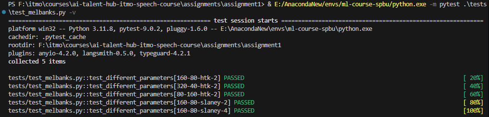
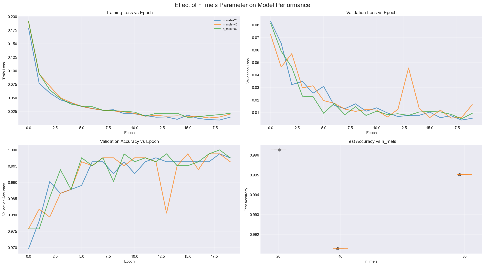
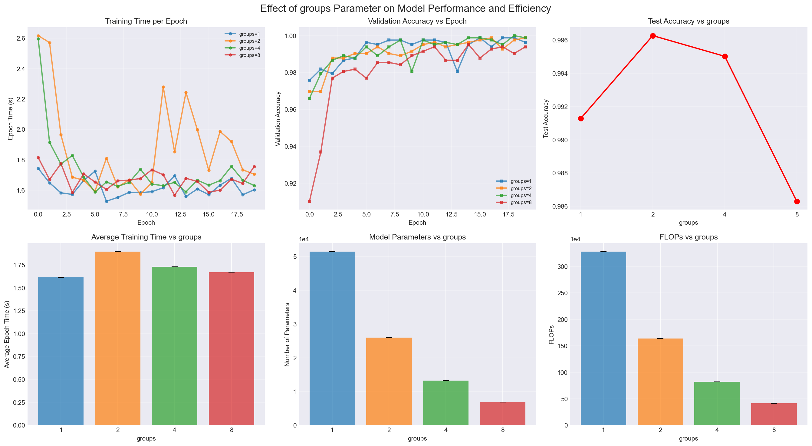

# Assignment 1. Digital Signal Processing - [20 pts]

## LogMelFilterBanks

- [**Implemented**](melbanks.py) a PyTorch layer (inherit a class from `torch.nn.Module`) for extraction of **logarithms of Mel-scale Filterbank energies** using basic `torch` operations (`torch.stft`, `torch.matmul`, `torch.log`) and so on.

- Wrote tests to check some possible values and compare with standart non log `torchaudio.transforms.MelSpectrogram` realization. To run them use:

    ```bash
    cd ./assignments/assignment1;
    python3 -m pytest .\tests\test_melbanks.py
    ```

    

## CNN Training with different N-mels and groups

Implemented basic 1D [CNN](model.py) (<= 100K parameters) to make binary classification on YES/NO phrases from  Google Speech Commands dataset. Number of epochs: 20

### Experiment 1

Varying `n_mels` param of CNN network ([20, 40, 80]).

- **Conslusion**: `n_mels` had a very small impact on loss or accuracy (`~99%`). As a baseline I take the model with `n_mels = 40` for the next stage as medium one.
- **Plot**:


### Experiment 2

Varying Conv1d groups param of CNN network ([1, 2, 4, 8])

- **Performance**: The epoch time while training process chandes minimally (~1.6-2.5sec on GPU), so there is no strong correlation during a training procedure between groups and epoch time.
- **Params & FLOPs**: As `groups` param icreasing the number of trainable parameters and FLOPs hightly reducing. Model with `group=8` required only ~13% of initial parameters (~6.8k compared to ~51k) while still achieving over ~98.6% test accuracy.
- **Plots**:

