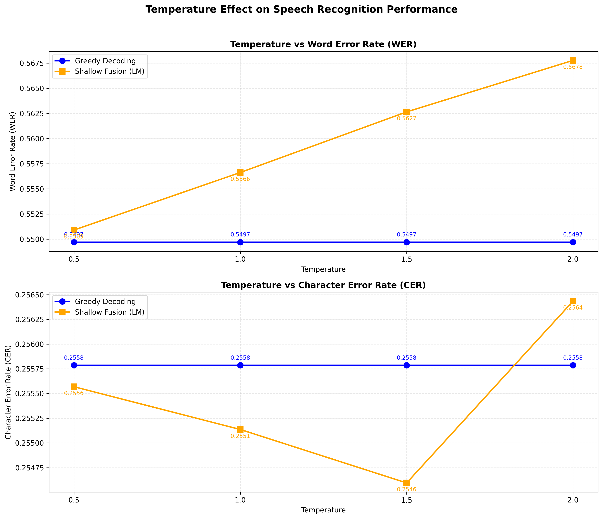

# Assignment 2. ASR Decoding - [20 pts]

## Part 1 — CTC Decoding

### Task 1. `greedy_decode` [[line 77]](wav2vec2decoder.py#77)

Was implemented `greedy_decode`, which simply finds best CTC path. Evaluation result on `data/librispeech_test_other/` dataset:

| Implementation | WER | CER |
|---|---|---|
| Reference | 10.4% | 3.5% |
| MyImplementation | 11.2% | 3.8% |

### Task 2. `beam_search_decode` [[line 100]](wav2vec2decoder.py#100)

Was implemented `beam_search_decode`, which perform beam search decoding without using any LM. Evaluation result on `data/librispeech_test_other/` dataset:

| Implementation | beam_width | WER | CER | Inference Time (1 decode, sec)
|---|---|---|---|---|
| Reference | - | 9.9% | 3.4% | - |
| MyImplementation | 1 | 11.2% | 3.8% | 0.36 |
| MyImplementation | 3 | 11.1% | 3.7% | 0.4 |
| MyImplementation | **10** | **11%** | **3.7%** | **0.57** |
| MyImplementation | 50 | 11% | 3.7% | 1.5 |

Heatmap:

So, as we can see WER getting lower with higher beam_width, but at the same time inference time also growing.

### Task 3. Temperature scaling for acoustic model outputs

Results of changing `T ∈ {0.5, 0.8, 1.0, 1.2, 1.5, 2.0}` on `data/librispeech_test_other/` using **greedy decoding**:

| Temperature | WER | CER |
|---|---|---|
| 0.5 | 11.2% | 3.8% |
| 0.8 | 11.2% | 3.8% |
| 1.0 | 11.2% | 3.8% |
| 1.2 | 11.2% | 3.8% |
| 1.5 | 11.2% | 3.8% |
| 2.0 | 11.2% | 3.8% |

As we can see from results temperature do not impact on WER and CER by **greedy decoding** method (argmax is invariant to scaling).

## Part 2 — Language Model Integration

### Task 4. `beam_search_with_lm` [[line 146]](wav2vec2decoder.py#146)

Was implemented `beam_search_with_lm`, which perform beam search decoding + **3-gram LM**. Evaluation result on `data/librispeech_test_other/` dataset:

| Implementation | alpha | beta | WER | CER |
|---|---|---|---|---|
| Reference | - | - | 9.7% | 3.4% |
| MyBestImplementationv1 | 1.0 | 1.0 | 10.9% | 3.76% |
| MyBestImplementationv2 | 0.05 | 0.5 | 11.02% | 3.76% |

Heatmap:

### Task 5. `beam_search_with_lm` using **4-gram LM**

Comparison 3-gram vs 4-gram LM using v1 and v2 best params from Task4.

LM | alpha | beta | WER | CER |
|---|---|---|---|---|
| 3-gram | 1.0 | 1.0 | **10.9%** | **3.76%** |
| 4-gram | 1.0 | 1.0 | 11.04% | 3.76% |
| 3-gram | 0.05 | 0.5 | 11.02% | 3.76% |
| 4-gram | 0.05 | 0.5 | **11%** | **3.76%** |

### Task 6. `lm_rescore` [[line186]](wav2vec2decoder.py#186)

Was implemented `beam_search_with_lm_rescore`, which perform beam search decoding + **3-gram LM** and later rescore. Evaluation result on `data/librispeech_test_other/` dataset:

| Implementation | alpha | beta | WER | CER |
|---|---|---|---|---|
| Reference | - | - | 9.6% | 3.3% |
| MyBestImplementationv1 | 0.01 | 1.0 | 11.09% | 3.76% |

Heatmap:

Conclusion:
Rescoring is highly more stable at high alphas: WER = 11.6% vs 20.8% (alpha=5.0) for shallow fusion, because sf not just rearrange, but also use it during the search.

Qualitative comparison between all previous methods:

| # | Reference (context) | Beam (context) | Shallow Fusion (context) | Rescoring (context) |
|---|---------------------|----------------|--------------------------|---------------------|
| 1 | ... the dark literally **aghast** with astonishment he ...... | ... the dark literally **agased** with astonishment he ...... | ... the dark literally **aghased** with astonishment he ...... | ... the dark literally **aghased** with astonishment he ...... |
| 2 | ... of vexation injured **amour** propre as the ...... | ... of vexation injured **amo** propra as the ...... | ... of vexation injured **amou** propra as the ...... | ... of vexation injured **amou** propra as the ...... |
| 3 | ... to force his **head** **through** recalling as... | ... to force his **headthrough** recalling as... | ... to force his **head through**✓ recalling as *... | ... to force his **head through**✓ recalling as... |
| 4 | ... prison for life **might** do it he ...... | ... prison for life **migh** doit he said ...... | ... prison for life **might**✓ doit he said ...... | ... prison for life **might**✓ doit he said ...... |
| 5 | ... with his heavy **eyelids** pressed down by... | ... with his heavy **iyelids** pressed down by... | ... with his heavy **eyelids**✓ pressed down by... | ... with his heavy **eyelids**✓ pressed down by... |
| 6 | ... like that to **andrew** teal the boy ...... | ... like that to **andreutel** the boy who ...... | ... like that to **andreuteal** the boy who ...... | ... like that to **andreuteal** the boy who ...... |
| 7 | ... thinking over this **knotty** question during which ...... | ... thinking over this **naty** question during which ...... | ... thinking over this **nadty** question during which ...... | ... thinking over this **nadty** question during which ...... |
| 8 | ... false alarm tell **sir** risdon they would ...... | ... false alarm tell **servacs** and they would ...... | ... false alarm tell **servance** and they would ...... | ... false alarm tell **servance** and they would ...... |
| 9 | ... of **boot toes** against **stone work** and astonished count... | ... of **boutos** against **onwork** and raham's face of the you... | ... of **boutos** against **tonwork** and raham's face of the yo... | ... of **boutos** against **tonwork** and raham's face of the yo... |
| 10 | **ram** was the first ...... | **rym** was the first ...... | **ryhm** was the first ...... | **ryhm** was the first ...... |

Diffent predictions from SF and Rescoring:

Reference:  **pipe** away the men to that boat there he said and as the crew sprang in
Beam:       **pip** away **the men** to that boat there he said and as the **crewsprang** in
Fusion:     **pip** away **themen** to that boat there he said and as the **crewsprang** in
Rescore:    **pip** away **themen** to that boat there he said and as the **crew** **sprang** in

Conclusions:

- LM mainly corrects word boundaries and even sometimes fix words errors: ``iyelids`` => ``eyelids``✓
- Yes, SF and RS sometimes disagree.
- Model sometimes can degradete quality compared to beam result: ``the men`` => ``themen``

### Task 7a. Between domain comparison

| Method | LibriSpeech WER | LibriSpeech CER | Earnings22 WER | Earnings22 CER |
|---|---|---|---|---|
| Greedy | 11.2% | 3.812% | 54.9% | 25.57% |
| Beam search | 11.07% | 3.769% | 55.1% | 25.4% |
| Beam + 3-gram (shallow fusion) | 10.99 | 3.764 | 55.18% | 25.44% |
| Beam + 3-gram (rescoring) | 11.09% | 3.769% | 55.18% | 25.47% |

Big gap between domains: ~11% vs ~55% WER (LibriSpeech vs Earnings22). This decrease in quality occurs because the acoustic model is trained on LibriSpeech audiobooks and does not generalize well to financial speech. Languale Model, which were trained at LibriSpeech too, slightly decrease the result at Earnings22 (produces more "literary" corrections rather than financial).

### Task 7b

The resulting plot:

Conclusions:

- Greedy always stays the same unchanged (argmax is invariant to scaling). Beam+LM deteriorates with increasing T: 55% → 56.7%;
- A high T smooths out the acoustic distribution => LM has more influence on the final score => but LM is trained on another dataset (LibriSpeech) => more mistakes in financial vocabulary
- Comparison with LibriSpeech (Task 3): the LM methods worked correctly at T=1, since both the acoustic model and the LM were trained on the same domain. On the other hand, the acoustic model has never seen Earnings22 and the error rate increases with increasing temperature.

### Task 8. Train financial LM

Were trained two **3-gram** models:

- Based on `earnings22_train`, can be found in `lm/financial-3gram-simple.arpa`
- Based on Bloomberg Financial News (<https://huggingface.co/datasets/danidanou/Bloomberg_Financial_News/tree/main>). Model is too large to load on git.

### Task 9. In-domain vs Out-of-domain LM models

| LM Model | Decode Method| Dataset | WER | CER |
|---|---|---|---|---|
| LibriSpeech 3-gram | BeamLM | LibriSpeech | 10.99% | 3.76% |
| LibriSpeech 3-gram | BeamLMRescore | LibriSpeech | 11.09% | 3.76% |
| LibriSpeech 3-gram | BeamLM | Earnings22 | 55.18% | 25.44% |
| LibriSpeech 3-gram | BeamLMRescore | Earnings22 | 55.18% | 25.47% |
| BaseFinancial | BeamLM | LibriSpeech | 11.07% | 37.74% |
| BaseFinancial | BeamLMRescore | LibriSpeech | 11.12% | 37.78% |
| BaseFinancial | BeamLM | Earnings22 | 54.7% | 25.38% |
| BaseFinancial | BeamLMRescore |Earnings22 | 54.93% | 25.43% |
| **ExtendFinancial** | **BeamLM** | **LibriSpeech** | **10.95%** | **3.76%** |
| ExtendFinancial | BeamLMRescore | LibriSpeech | 11.07% | 3.78% |
| ExtendFinancial | BeamLM | Earnings22 | 54.38% | 25.14% |
| **ExtendFinancial** | **BeamLMRescore** |**Earnings22** | **54.35%** | **25.1%** |

Conclusions:

1. Get's and improvement on Earnings22 dataset:
    - Base: (WER, 54.7% vs 55.18%), because of small alpha (0.05) optimized for LibriSpeech (and maybe small corpus).
    - Extend: (WER, 54.3% vs 55.18%), also because of small alpha
2. The bigger corpus improved financial LM: WER => 54.3% vs 54.7%, CER => 25.1% vs 25.4%
3. The extended financial LM has also improved LibriSpeech: 10.9% vs 11.07%. Bloomberg news corpus contains a lot of common vocabulary
4. On `earning22` dataset domain-matched LM win, but on `LibriSpeech` extended financial LM get lower WER.
5. **But the whole improvements not so significant: Extend LM gives a relatively small boost (~0.5-1%) and WER still around 54% => if the initial acoustic model is weak on domain, then LM trained on a large dataset cannot significantly improve the metrics.**
